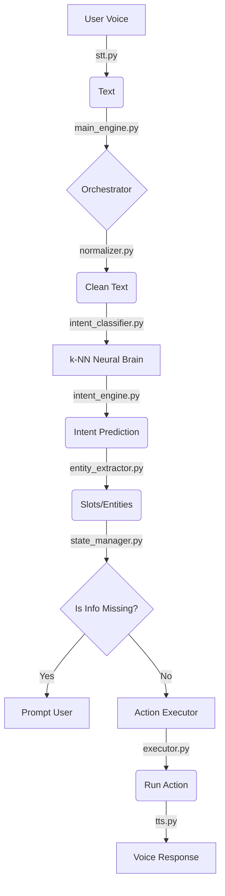

# Jarvis v3.0 — Complete Code Walkthrough & Documentation

This document provides an exhaustive, file-by-file explanation of the **A.E.R.I.S (Advanced Entity-Recognition & Intent-System)** codebase, also known as **Jarvis v3.0**. 

---

## 1. System Architecture Overview

Before looking at the code, here is how the data flows through the system:



---

## 2. Core Modules (The Brain Stack)

### A. The Orchestrator — `core/main_engine.py`
This is the "General" of the army. It coordinates every other module.

**What it does:**
- Manages the lifecycle of a command.
- Handles multi-turn conversations (slot-filling).
- Splitting compound commands (e.g., "Open Chrome *and* play music").
- Manages the feedback loop ("Galat hai" → correction).

**Key Code Snippet (The Pipeline):**
```python
def process_text(self, text: str):
    # 1. Handle existing state (Are we waiting for a name/time?)
    if self.state.is_waiting_slot():
        return self.handle_slot_filling(text)

    # 2. Memory Recall (Do we know this fact?)
    recall = self.memory.detect_and_recall(text)
    if recall: return recall

    # 3. Predict Intent (The k-NN logic)
    pred = self.brain.predict(text)

    # 4. Extract Entities (Get 'Chrome', '5 PM', etc.)
    entities = self.entity_extractor.extract(text, pred.intent)

    # 5. Execute
    return self.executor.execute(pred.intent, entities)
```

---

### B. The Neural Brain — `core/intent_classifier.py`
This is where the AI lives. It uses **Vector Embeddings** and **k-NN**.

**What it does:**
- Converts text into 384-dimensional vectors using `SentenceTransformer`.
- Uses k-Nearest Neighbors to find the most similar command in your `intents.json`.

**Key Interview Point:** 
Explain that you use **Cosine Similarity**. It measures the *angle* between two vectors. If the angle is small, the meaning is similar.

---

### C. The Entity Extractor — `core/entity_extractor.py`
The "Detective" that finds specific information in your sentence.

**The 4 Layers of Extraction:**
1.  **Regex Layer:** Uses patterns to find Times, URLs, and Numbers.
2.  **Gazetteer Layer:** A dictionary of app names (found in `data/entities.json`).
3.  **spaCy NER:** A professional AI library to find names of people and places.
4.  **Residual Layer:** "The Leftovers." If you say "Search **Python Tutorial**", and the system knows "Search" is the command, it assumes the rest (**Python Tutorial**) is the query.

---

### D. The Action Executor — `core/executor.py`
The "Hands" of Jarvis. This file contains the actual Python code to control your computer.

**Key Functionalities:**
- `open_application()`: Uses `subprocess` and `shutil.which` to find and launch apps.
- `close_application()`: Uses `psutil` to find running processes and kill them.
- `volume_change()`: Uses `ctypes` to talk directly to the Windows API for volume control.
- `search_web()`: Uses `webbrowser` to open Google.

---

### E. Speech & Voice — `core/stt.py` & `core/tts.py`
The "Ears" and "Mouth" of the system.

- **STT (Listen):** Uses `recognize_google` (Online) for high accuracy and **Vosk** (Offline) as a backup. It uses the `en-IN` locale to support Hinglish.
- **TTS (Speak):** Uses **Edge-TTS** for a premium, human-like voice (`NeerjaNeural`). It sounds much better than the standard robotic Windows voice.

---

## 3. Data & Memory

### `data/intents.json`
This is your **Training Data**. 
- It defines the **Intents** (e.g., `open_app`).
- It provides **Examples** (e.g., "chrome kholo").
- It defines **Required Entities** (e.g., `app_name`).

### `data/user_memory.json`
This stores personal facts. If you say "My name is Shivang", Jarvis saves it here so he can recall it later.

---

## 4. Why is this "Advanced"? (Interview Gold)

1.  **Hybrid STT/TTS:** You don't rely 100% on the cloud. If the internet fails, Jarvis still works.
2.  **k-NN Classification:** You aren't using simple "if-else" keywords. You are using a high-dimensional vector space.
3.  **Slot Filling:** Jarvis doesn't just fail if you forget a detail. If you say "Meeting lagao" (Schedule a meeting), he will *ask* you "With whom?" and "At what time?". This is called a **stateful conversation**.
4.  **Multi-Command Support:** You can say three things in one sentence, and the engine will split them and run them all in order.
5.  **Feedback Loop:** The system learns. If you say "That's wrong," it records that failure to a SQLite database to improve the confidence thresholds in the future.
